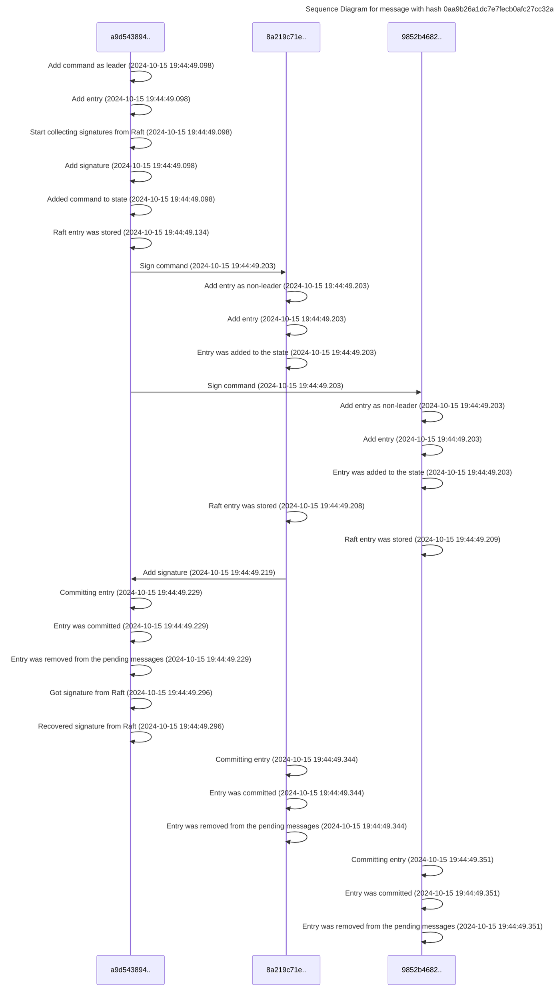

# Transporting Validator Signatures over Raft in Nimbus

## Introduction

Nimbus integrates the Raft consensus algorithm to ensure that a cluster of nodes can act as a single logical unit. This setup ensures that signatures for attestations and blocks are only propagated to the Ethereum network when they have been securely replicated and agreed upon by a critical number of nodes—specifically, more than half of the nodes in the cluster (`number_of_nodes / 2 + 1`).

This document focuses on **how validator signatures are transported on top of Raft messages** and **how Nimbus ensures the invariants of replication and the successful collection of the needed signatures**.

## Workflow Overview

1. **Leader Election**: Raft elects a leader among the nodes in the cluster.

2. **Signing Request Initiation**: A signing request (e.g., for a block proposal or an attestation) is initiated by the leader.

3. **Command Creation**: The leader creates a command representing the signing request and adds it to its Raft log.

4. **Log Replication**: The command is replicated across the cluster via Raft's log replication mechanism.

5. **Signature Generation**: Each node, upon receiving the command and appending it to its Raft log, generates a signature share using its private key.

6. **Signature Share Collection**: Signature shares are collected by the leader and combined to form a complete signature.

7. **Commitment**: Once the signature is assembled and the command is committed in the Raft log, the command is committed to the slashing protection database. The validator is then allowed to continue with the commitment to the Ethereum network.

## Transporting Validator Signatures over Raft Messages

### Signature Generation and Transport

1. **Command Reception**: Nodes receive the replicated command via Raft messages sent to the endpoint `"/eth/v1/raft/message"`.

2. **Signature Share Creation**: Each node generates a signature share for the command using its private key.

3. **Signature Share Transmission**: Signature shares are sent back to the leader or collected through Raft messages, again via `"/eth/v1/raft/message"`.

### Handling Timeouts

- **Timeouts**: If signature shares are not received within a specified timeframe (6 seconds), the operation fails to prevent indefinite waiting.

- **Retries**: The Raft state machine may attempt to replicate the log again if some messages are not delivered.

### Slashing Protection Integration

- **Registration**: Before a command is committed, it is registered with the slashing protection database to prevent double-signing.

- **Commitment**: Commands are only committed once they have been securely replicated and have passed slashing protection checks.

## Additional Details

- **Validator Duties Replication**: The current implementation assumes that Raft is used only to replicate validator duties.

- **Unique Message Identification**: To differentiate between messages for different validators, Raft generates a unique ID for each message using a hash function:

  ```nim
  hash = ($sha256.digest(entry.toBytes) & $pubkey)[0..<32]
  ```

  This hash uses the first 32 ASCII characters of the SHA256 digest string representation, which is used when Raft batches messages from different validators into a single request.

- **Network Traffic Optimization**:

  - It's possible to reduce network traffic by using fewer bytes from the message hash.

  - Currently, Raft uses a shortened form of the validator public key as the Raft node ID (first 8 hex characters), which is included in each message. In the future, we can reduce network traffic by using a more efficient identifier scheme.

- **Message Packing Optimization**:

  - To minimize bandwidth usage, Raft uses a message packing scheme that deduplicates identical message payloads.
  
  - Messages are sent as two arrays:
    - `raw_message`: Contains sender, receiver, term, and an index (`anon_index`) pointing to the message payload
    - `anon_messages`: Contains the deduplicated message payloads
  
  - When broadcasting the same message (e.g., AppendRequest) to multiple followers, the payload is stored once in `anon_messages`, and multiple entries in `raw_message` reference it by index.
  
  - Field names are shortened for bandwidth optimization: `c` (currentTerm), `s` (sender), `r` (receiver), `a` (anon_index or appendRequest), `k` (kind), etc.

- **Signature Transport Dependency**:

  - Currently, the Raft protocol is used to transport the signatures, which may be an undesirable dependency.

  - Right now, the shared key should be generated in a `(k/n)` scheme where `k = number_of_nodes_cluster / 2 + 1`. In the future, we can decouple the signature transport to provide different signing schemes.

## Security

Since Raft uses HTTP APIs for communication, it can serve as a potential attack vector for the node. It's important to implement appropriate security measures around the nodes in the cluster. For example, setting up a VPN for nodes operating within the same cluster can help protect the communication and enhance security.

## Typical Raft Transportation Scenario

Note: The leader doesn't necessarily need to wait for all signatures. Once consensus is reached, it only requires enough partial signatures to construct the final signature.


